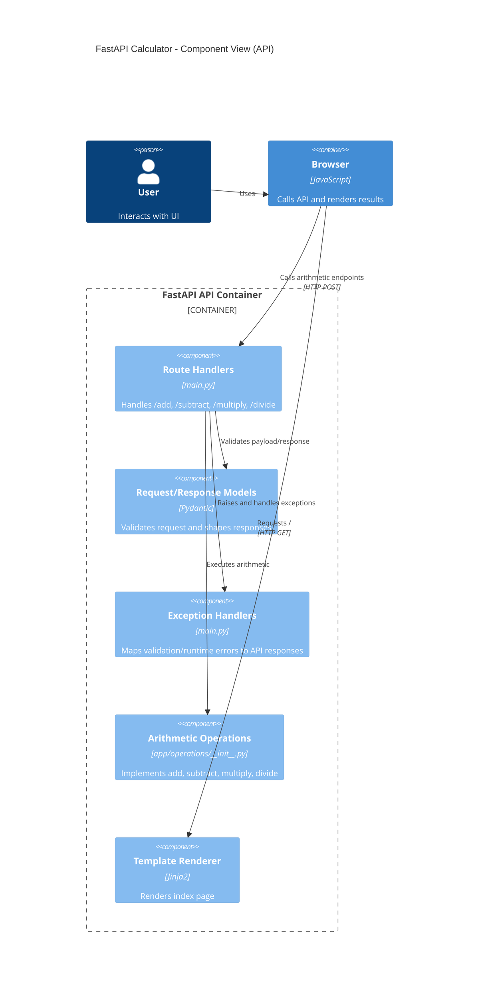

# C4 Component Diagram

```mermaid
C4Component
title FastAPI Calculator - Component View (API)

Container_Boundary(api_boundary, "FastAPI API Container") {
  Component(routes, "Route Handlers", "main.py", "Handles /add, /subtract, /multiply, /divide")
  Component(models, "Request/Response Models", "Pydantic", "Validates request and shapes responses")
  Component(errors, "Exception Handlers", "main.py", "Maps validation/runtime errors to API responses")
  Component(operations, "Arithmetic Operations", "app/operations/__init__.py", "Implements add, subtract, multiply, divide")
  Component(template, "Template Renderer", "Jinja2", "Renders index page")
}

Person(user, "User", "Interacts with UI")
Container(browser, "Browser", "JavaScript", "Calls API and renders results")

Rel(user, browser, "Uses")
Rel(browser, template, "Requests /", "HTTP GET")
Rel(browser, routes, "Calls arithmetic endpoints", "HTTP POST")
Rel(routes, models, "Validates payload/response")
Rel(routes, operations, "Executes arithmetic")
Rel(routes, errors, "Raises and handles exceptions")
```
