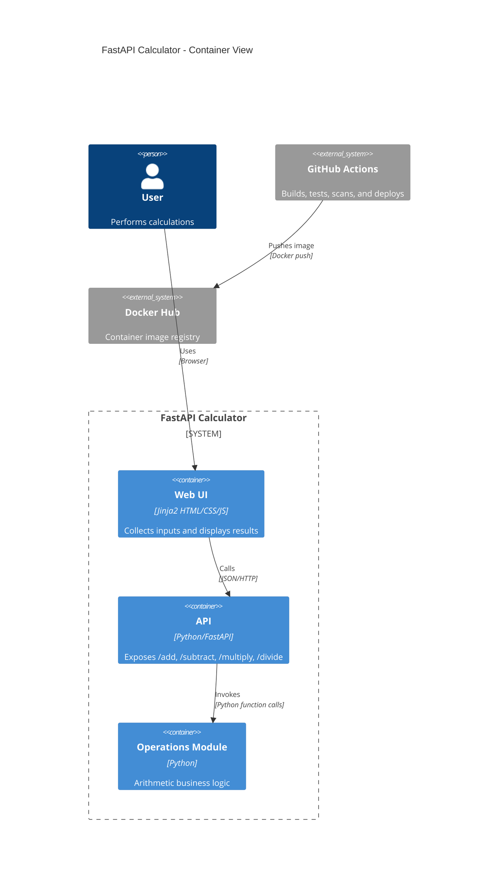

# C4 Container Diagram

```mermaid
C4Container
title FastAPI Calculator - Container View

Person(user, "User", "Performs calculations")
System_Ext(github, "GitHub Actions", "Builds, tests, scans, and deploys")
System_Ext(dockerhub, "Docker Hub", "Container image registry")

System_Boundary(calc, "FastAPI Calculator") {
  Container(webui, "Web UI", "Jinja2 HTML/CSS/JS", "Collects inputs and displays results")
  Container(api, "API", "Python/FastAPI", "Exposes /add, /subtract, /multiply, /divide")
  Container(ops, "Operations Module", "Python", "Arithmetic business logic")
}

Rel(user, webui, "Uses", "Browser")
Rel(webui, api, "Calls", "JSON/HTTP")
Rel(api, ops, "Invokes", "Python function calls")
Rel(github, dockerhub, "Pushes image", "Docker push")
```
