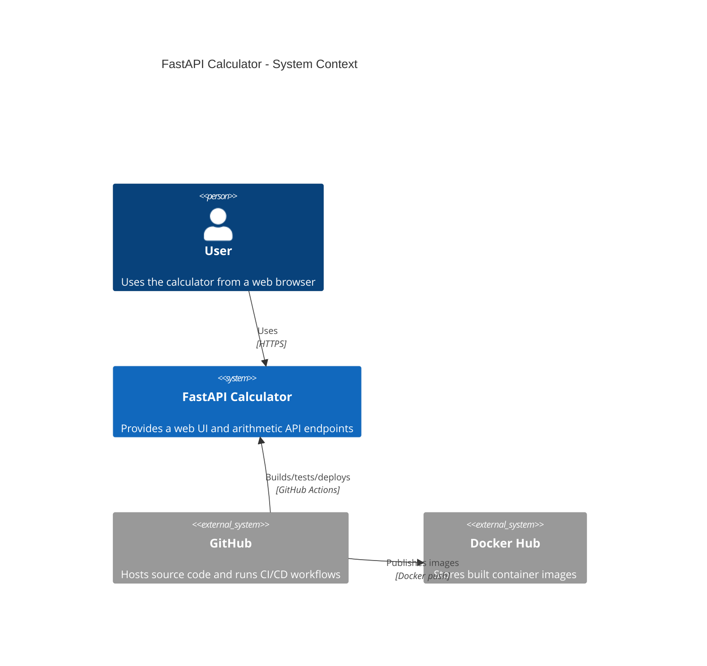

# C4 Context Diagram

```mermaid
C4Context
title FastAPI Calculator - System Context

Person(user, "User", "Uses the calculator from a web browser")
System(calculator, "FastAPI Calculator", "Provides a web UI and arithmetic API endpoints")
System_Ext(github, "GitHub", "Hosts source code and runs CI/CD workflows")
System_Ext(dockerhub, "Docker Hub", "Stores built container images")

Rel(user, calculator, "Uses", "HTTPS")
Rel(github, calculator, "Builds/tests/deploys", "GitHub Actions")
Rel(github, dockerhub, "Publishes images", "Docker push")
```
