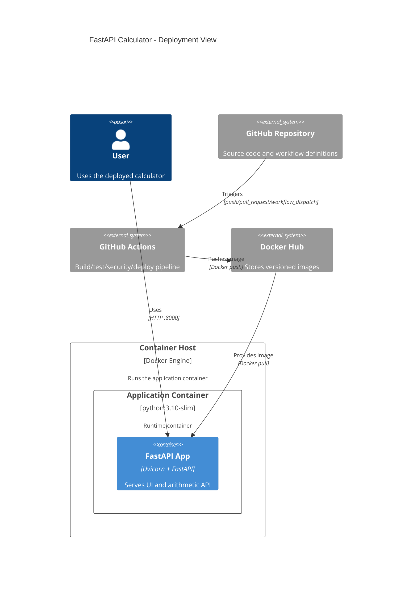

# C4 Deployment Diagram

```mermaid
C4Deployment
title FastAPI Calculator - Deployment View

Person(user, "User", "Uses the deployed calculator")
System_Ext(git, "GitHub Repository", "Source code and workflow definitions")
System_Ext(gha, "GitHub Actions", "Build/test/security/deploy pipeline")
System_Ext(registry, "Docker Hub", "Stores versioned images")

Deployment_Node(host_machine, "Container Host", "Docker Engine", "Runs the application container") {
  Deployment_Node(app_runtime, "Application Container", "python:3.10-slim", "Runtime container") {
    Container(app_service, "FastAPI App", "Uvicorn + FastAPI", "Serves UI and arithmetic API")
  }
}

Rel(user, app_service, "Uses", "HTTP :8000")
Rel(git, gha, "Triggers", "push/pull_request/workflow_dispatch")
Rel(gha, registry, "Pushes image", "Docker push")
Rel(registry, app_service, "Provides image", "Docker pull")
```
