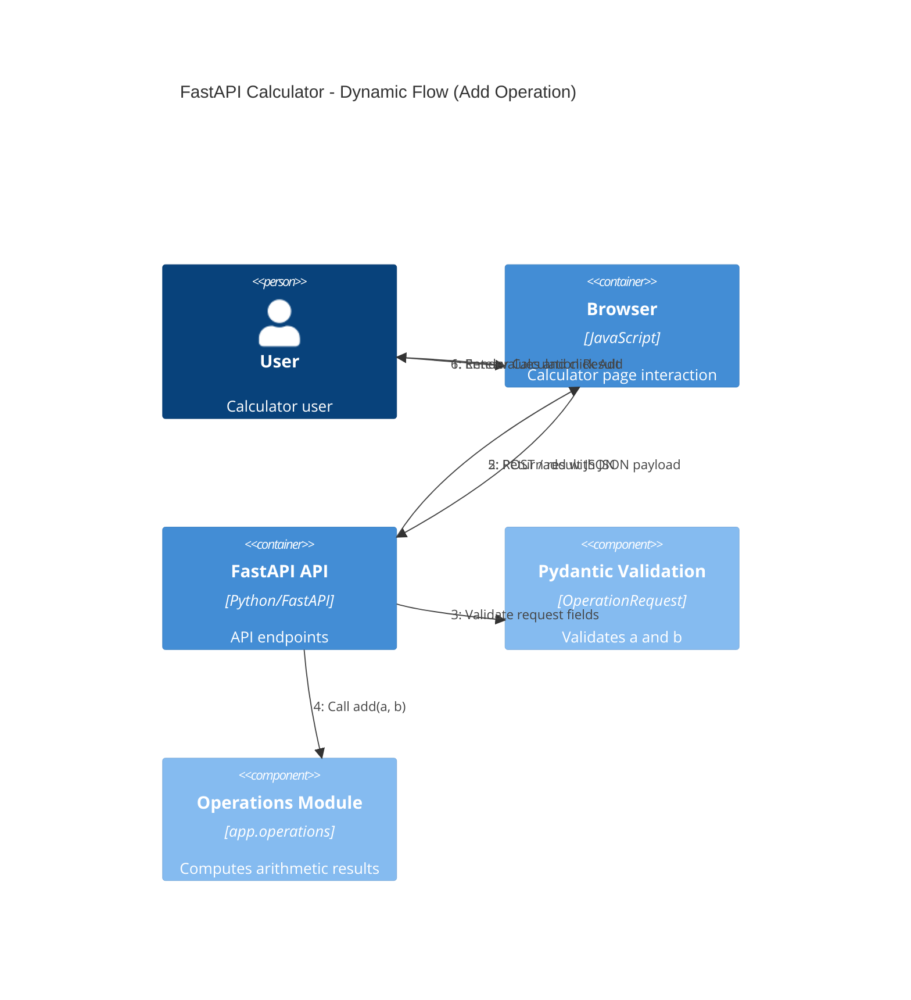

# C4 Dynamic Diagram

```mermaid
C4Dynamic
title FastAPI Calculator - Dynamic Flow (Add Operation)

Person(user, "User", "Calculator user")
Container(browser, "Browser", "JavaScript", "Calculator page interaction")
Container(api, "FastAPI API", "Python/FastAPI", "API endpoints")
Component(validation, "Pydantic Validation", "OperationRequest", "Validates a and b")
Component(service, "Operations Module", "app.operations", "Computes arithmetic results")

RelIndex(1, user, browser, "Enter values and click Add")
RelIndex(2, browser, api, "POST /add with JSON payload")
RelIndex(3, api, validation, "Validate request fields")
RelIndex(4, api, service, "Call add(a, b)")
RelIndex(5, api, browser, "Return result JSON")
RelIndex(6, browser, user, "Render Calculation Result")
```
